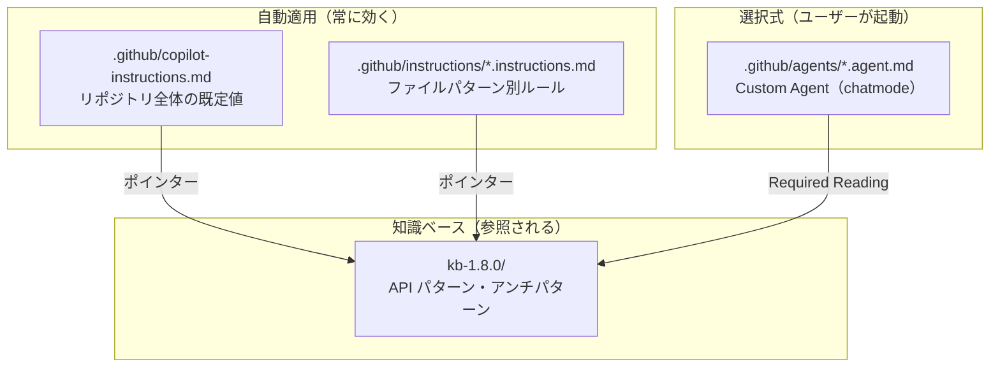
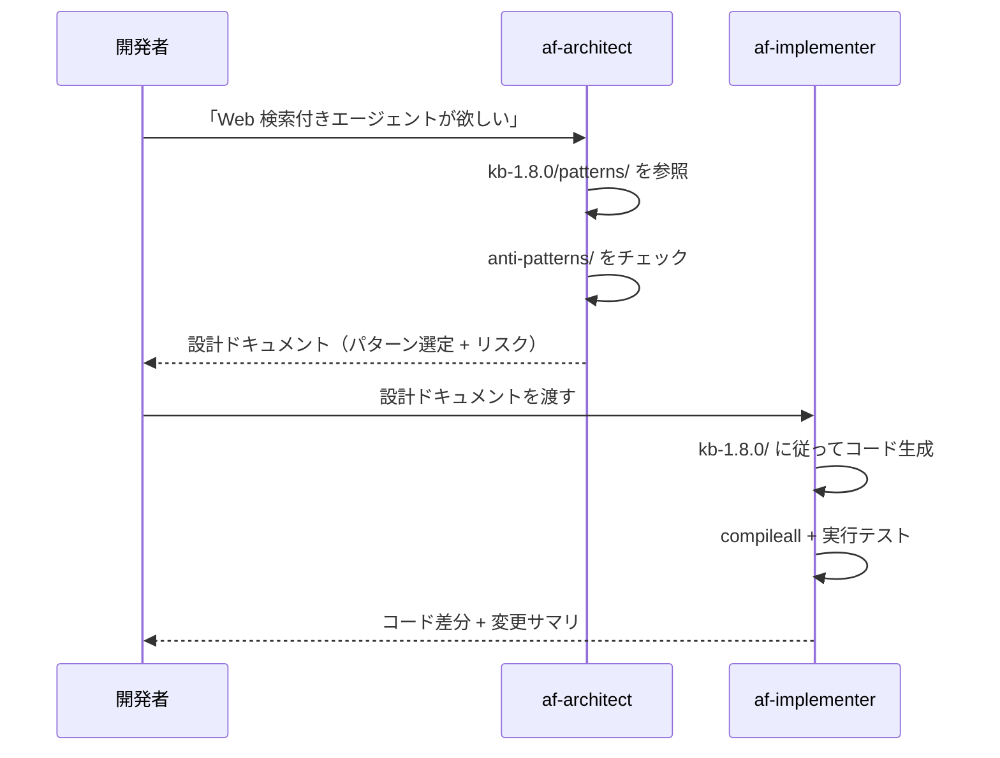

# Lab 1: GitHub Copilot のカスタマイズ機構を理解する

## この Lab の目的

- GitHub Copilot をリポジトリに合わせてカスタマイズする **2 つの仕組み** を理解する
  - **Custom Instructions** — 常に自動適用されるルール
  - **Custom Agents** — 選んで使う専門家ペルソナ
- このリポジトリに実装されている具体的なファイルを読み解く

> [!NOTE]
> この Lab は講師による解説セッションです。Lab 2 以降では、ここで紹介するカスタマイズが「効いている」前提で Copilot を活用してエージェントを構築します。

---

## 1-1. 全体像: Copilot カスタマイズの階層



| 仕組み | いつ効くか | 用途 |
|---|---|---|
| Custom Instructions | **常に自動** — ファイルを開いた瞬間に適用 | コーディング規約、環境変数ルール、スタイルガイド |
| Custom Agents | **ユーザーが選択** — chatmode dropdown で切替 | 設計レビュー、実装、運用トリアージなど専門タスク |

---

## 1-2. Custom Instructions (`.github/instructions/`)

### 仕組み

Custom Instructions は **YAML フロントマター付きの Markdown ファイル** です。VS Code で Copilot が起動すると、`.github/instructions/` 配下のファイルを自動的にロードします。

```yaml
---
applyTo: "**/*.py"          # どのファイルに対して有効か（glob パターン）
description: "説明文..."     # Copilot が「今このルールを参照すべきか」を判断する文章
---

# ここにルール本文を Markdown で記述
```

**2 つのフロントマターキーが全て**：

| キー | 役割 | 例 |
|---|---|---|
| `applyTo` | 適用対象を glob パターンで指定 | `**` = 全ファイル、`**/*.py` = Python のみ |
| `description` | Copilot の判断材料 — この文章にマッチする質問が来たとき本文を参照 | 長いほど精度が上がるが、コンテキストを消費する |

### このリポジトリの Instructions 一覧

| ファイル | `applyTo` | 役割 |
|---|---|---|
| [`agent-framework-azure-ai-py.instructions.md`](../.github/instructions/agent-framework-azure-ai-py.instructions.md) | `**` | Agent Framework API 知識の **ポインター**（本体は `kb-1.8.0/`） |
| [`python.instructions.md`](../.github/instructions/python.instructions.md) | `**/*.py` | Python コーディング規約（型ヒント、async/await、環境変数の扱い） |
| [`docs.instructions.md`](../.github/instructions/docs.instructions.md) | `**/*.md` | Markdown 記述規約（言語タグ、callout、リンク形式） |

### `applyTo` パターンの使い分け

| パターン | 意味 | ユースケース |
|---|---|---|
| `**` | 全ファイル | リポジトリ横断のルール（API 知識、全体方針） |
| `**/*.py` | 全ての Python ファイル | コーディング規約 |
| `**/*.md` | 全ての Markdown ファイル | ドキュメント スタイルガイド |
| `src/**/*.py` | `src/` 配下の Python のみ | プロダクションコード固有のルール |

> [!IMPORTANT]
> `applyTo: "**"` は Copilot の **毎回のコンテキストに含まれる** ため、ファイル本文が長すぎるとトークンを浪費します。大量の知識は `kb-1.8.0/` のような外部ファイルに置き、instruction はポインター（参照先を示すだけ）にするのがベストプラクティスです。

### `description` が Copilot の判断にどう影響するか

```text
ユーザーの質問
    ↓
Copilot が各 instruction の description を照合
    ↓
マッチ度が高い → instruction 本文をコンテキストに追加
マッチしない → スキップ（トークン節約）
```

**`description` の書き方で精度が決まる**：
- ✅ 具体的なキーワードを含める（`FoundryChatClient`、`@tool`、`agent.run`）
- ✅ 「いつ参照すべきか」をタスク形式で列挙する
- ❌ 曖昧な一般論（「Python のベストプラクティス」）

### 実例: API 知識ポインターの `description`

```yaml
description: Microsoft Agent Framework Python SDK (agent-framework-foundry) で
  Microsoft Foundry のエージェントを作るための skill。FoundryChatClient /
  FoundryAgent によるエージェント作成、ホスト型ツール（Code Interpreter /
  File Search / Web Search / ...）や関数ツール（@tool）の追加、ローカル MCP 連携
  (MCPStreamableHTTPTool 等)、AgentSession による会話継続、...
```

→ この長い description により、上記キーワードのいずれかを含む質問が来ると `kb-1.8.0/` の知識が自動参照される。

---

## 1-3. Custom Agents (`.github/agents/`)

### 仕組み

Custom Agents は **VS Code の chatmode** として動作する Markdown ファイルです。Copilot Chat の左上にある **chatmode dropdown** からユーザーが選択して使います。

```yaml
---
name: af-architect              # chatmode の ID（dropdown に表示）
description: "ペルソナの説明"    # chatmode picker に表示される 1 行説明
tools: ["read", "search"]       # 使用できるツール
infer: true                     # ワークスペースから追加コンテキストを推論するか
---

# ここにペルソナの詳細な指示（system prompt 相当）
```

### フロントマターの 4 つのキー

| キー | 型 | 説明 |
|---|---|---|
| `name` | string | chatmode ID — `[a-z][a-z0-9-]*`、kebab-case |
| `description` | string | chatmode picker に表示。1 行でペルソナとスコープを伝える |
| `tools` | list | `["read", "search", "edit", "execute"]` のサブセット |
| `infer` | boolean | `true` = ワークスペースのコンテキストを自動推論 |

> [!NOTE]
> `tools` は **許可リスト** です。`af-architect` は `["read", "search"]` のみ — 意図的にコードを書けない設計です。

### このリポジトリの Agent 一覧

| Agent | ファイル | 役割 | tools |
|---|---|---|---|
| **af-architect** | [`af-architect.agent.md`](../.github/agents/af-architect.agent.md) | 設計アドバイザー。要件を KB 引用付きの設計ドキュメントに変換する | `read`, `search` |
| **af-implementer** | [`af-implementer.agent.md`](../.github/agents/af-implementer.agent.md) | 実装エージェント。設計ドキュメントを最小差分のコードに落とす | `read`, `search`, `edit`, `execute` |

### af-architect: 設計アドバイザー

**できること:**
- 要件を聞いて、`kb-1.8.0/patterns/` から適切なパターンを選定
- `kb-1.8.0/anti-patterns/` を参照してアンチパターンを警告
- ツール構成・リスク・依存関係を整理した **設計ドキュメント** を出力

**できないこと（意図的な制限）:**
- ❌ コードを書く（`edit` 権限がない）
- ❌ コマンドを実行する（`execute` 権限がない）
- ❌ ファイルをディスクに書き込む

**出力フォーマット（固定構造）:**

```text
## Requirement Summary
## Pattern Selection       ← KB 引用付きの選定表
## Tool Inventory          ← 関数ツール / ホスト型ツール / MCP の一覧
## Risk Register           ← リスクと対策
## Implementation Scope    ← MVP と Optional の分離
## Hand-off                ← af-implementer への引き継ぎ
```

### af-implementer: 実装エージェント

**できること:**
- `af-architect` の設計ドキュメントを受け取り、最小差分でコードを実装
- `kb-1.8.0/` のパターンに正確に従う
- `python3 -m compileall` で構文検証、可能なら実行テスト

**制限（守るべきルール）:**
- ❌ KB に存在しないパターンを推測で書かない
- ❌ 削除済み API（`HostedWebSearchTool` 等 12 個）を使わない
- ❌ 本番想定のモデル名やリージョンを勝手に変えない

### 2 つの Agent の連携フロー（ハンドオフ）



**ポイント:**
- architect は「**何を作るか**」を決め、implementer は「**どう作るか**」を実行する
- architect は read/search しかできないので、コードを書く誘惑がない
- implementer は KB に忠実に動くので、架空の API を使わない

### Agent body の内部構造

両 Agent とも以下の **コアセクション** を持ちます（順序が契約）:

| # | セクション | 目的 |
|---:|---|---|
| 1 | Opening paragraph | ペルソナの自己紹介（1 段落） |
| 2 | Objectives | 優先順位付きの目標リスト（3〜5 項目） |
| 3 | Accuracy and Version Awareness | 参照すべき KB パスと検証順序 |
| 4 | Workflow | リクエストごとに従うステップ |
| 5 | Output Format | 出力の固定構造 |
| 6 | Quality Standards | 品質基準 |
| 7 | Restrictions | やってはいけないこと |
| 8 | Hand-off | 次の Agent への引き継ぎ方法 |

---

## 1-4. Instructions vs Agents: いつ何を使うか

| 観点 | Custom Instructions | Custom Agents |
|---|---|---|
| 起動方法 | **自動**（ファイルを開くだけ） | **手動**（chatmode を選択） |
| スコープ | ファイルパターン (`applyTo`) で制御 | 選択中のみ有効 |
| 主な用途 | ルール・規約・知識ポインター | 専門タスク（設計、実装、レビュー） |
| 出力形式 | コード生成時の「制約」として機能 | Agent 固有の構造化出力 |
| ツール制限 | なし（通常の Copilot 権限） | `tools` で明示的に制限可能 |
| 典型的なサイズ | 50〜100 行（またはポインター） | 100〜200 行（詳細なワークフロー定義） |

**使い分けの判断基準:**

- 「**どのファイルでも常に守ってほしいルール**」→ Instructions
- 「**特定のタスクで専門家として振る舞ってほしい**」→ Agents

---

## 1-5. まとめ

| キーワード | 意味 |
|---|---|
| `.github/instructions/*.instructions.md` | 自動適用ルール — `applyTo` でスコープ指定 |
| `.github/agents/*.agent.md` | chatmode — 選んで使う専門家ペルソナ |
| `description` | Copilot が「参照すべきか」を判断する根拠 |
| `tools` | Agent に許可する操作（read / search / edit / execute） |
| ポインター方式 | instruction は軽く、知識本体は `kb-1.8.0/` に分離 |
| ハンドオフ | architect → implementer のように Agent 間で成果物を受け渡す |

> [!TIP]
> Lab 2 以降では Copilot Chat で直接コードを生成します。その際、ここで見た Instructions（Python 規約・API 知識）が **裏側で常に効いている** ことを意識してください。Custom Agent を使いたい場合は chatmode dropdown から `af-architect` や `af-implementer` を選択できます。

---

次へ → [Lab 2: MAF で Microsoft 最新情報エージェント作成](02-maf-agent.md)
