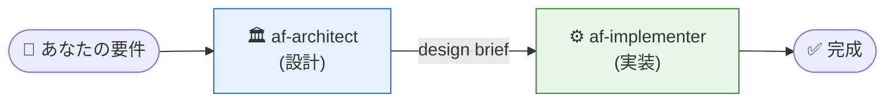

# Lab 2: MAF で Microsoft 最新情報エージェント作成

## この Lab で行うこと

**Lab 1 で確認した Agent Skill を使って、Copilot にエージェントを作らせます。** 自分で MAF の API を覚える必要はありません。Copilot に **何を作りたいか** を伝えるだけで、skill が裏で正しいパターンを供給します。

完成するエージェント：

- **名前**: MS Updates Agent
- **連携先**: [Microsoft Release Communications MCP Server](https://learn.microsoft.com/ja-jp/microsoft-365/admin/manage/mrc-mcp?view=o365-worldwide)
- **エンドポイント**: `https://www.microsoft.com/releasecommunications/mcp`（**認証不要**）
- **機能**: Microsoft 365 メッセージ センター、ロードマップ、Azure Updates、Microsoft Learn を自然言語で照会

> Lab 3 でこのコードをほぼそのまま **Foundry Hosted Agent** に載せます。Lab 2 で動かすコードと Lab 3 のコンテナ用 `main.py` の差分は最小限になるよう設計しています。

## 前提

- [Lab 0](00-setup.md) で `.venv` 有効化済み、`agent-framework-foundry` インストール済み（`from agent_framework.foundry import FoundryChatClient` が成功している）
- [Lab 1](01-agent-skills.md) で MAF × Foundry の skill が Copilot に認識されていることを確認済み
- `.env` に `FOUNDRY_PROJECT_ENDPOINT` と `FOUNDRY_MODEL` が設定済み

---

## 2-0. この Lab で使う chatmode (推奨ワークフロー)

この Lab では **2 種類のカスタム chatmode** をフェーズごとに切り替えて使います。default の Agent mode のままだと KB (`kb-1.8.0/`) の体系的な読み込みが保証されず、1.8.x で deprecated になった API (例: `async with FoundryChatClient(...)`) を生成してしまうリスクがあります。chatmode を切り替えることで「設計 → 実装」の hand-off が機械的に進みます。



| Chatmode | この Lab での役割 | 使用 section |
|---|---|---|
| **`af-architect`** | 要件を 7-section の design brief (パターン選択・anti-pattern flag・risk register・open question) に変換。コードは書かない。 | 2-1 (Step 1) |
| **`af-implementer`** | design brief を元に canonical pattern (`client = FoundryChatClient(...)` → `async with client.as_agent(...)`) で最小 diff のコードを生成。 | 2-1 (Step 2) / 2-3 / 2-4 / 2-5 |

### chatmode の切り替え方

VS Code Insiders の Copilot Chat パネルで：

1. **チャット入力欄の下部にある chatmode picker** (デフォルトは「Agent」と表示) をクリック
2. リストから `af-architect` / `af-implementer` のいずれかを選択
3. プロンプトを入力して送信

> [!TIP]
> 切り替え後はパネル左上の chatmode 名で現在のモードを確認できます。要件の性質に応じて以下の使い分けが目安です：
> - **要件が曖昧 / パターン選択に迷う** → まず `af-architect` に design brief を出してもらう
> - **やることが明確 / 既存コードの拡張** → `af-implementer` を直接呼ぶ

---

## 2-1. Copilot にエージェントの骨格を作らせる

VS Code で `src/agent.py` を新規作成（`src/` フォルダーがなければ Copilot が作ります）。

### Step 1 — `af-architect` で設計ブリーフを作る

Copilot Chat の chatmode picker で **`af-architect`** に切り替え、`Ctrl+Alt+I` でチャット入力欄を開いて以下を入力：

````
Microsoft 365 と Azure の最新リリース情報を回答する日本語エージェントを作りたいです。

要件：
- Microsoft Agent Framework Python SDK で実装
- Microsoft Foundry に接続 (.env で project_endpoint と model を渡す)
- エージェント名は "MSUpdatesAgent"
- Microsoft Release Communications MCP (https://www.microsoft.com/releasecommunications/mcp, 認証不要) と連携
- 回答は日本語、必ず MRC MCP のツールを使い、出典 URL を添える
- ローカル CLI として python src/agent.py で実行

design brief を出してください。
````

`af-architect` は `kb-1.8.0/` を体系的に読み、以下のような design brief を返します（実機検証済み）：

| Brief section | 期待される内容例 |
|---|---|
| **Pattern Selection** | `kb-1.8.0/patterns/canonical-agent-creation.md` (Foundry + as_agent) を採用、`kb-1.8.0/patterns/structured-output-pydantic.md` は今回不要と判断 |
| **Anti-pattern flags** | `missing-async-with-cleanup.md` (FoundryChatClient は async CM ではない) / `sync-credential-in-async.md` (async cred を強制) / `empty-env-vars-codespaces.md` (.env 空文字列対策) |
| **Tool inventory** | `MCPStreamableHTTPTool` (`kb-1.8.0/api-reference/1.8.0/tools-mcp.md`) を選択、stability tier は Stable |
| **Risk register** | mcp パッケージ optional extra / FoundryChatClient の async with 誤用リスク / model deployment 名不一致 |
| **Open questions** | session 継続が必要か / streaming 出力が必要か / 出典 URL の format |
| **Hand-off** | → `af-implementer` |

### Step 2 — `af-implementer` でコードを生成する

chatmode picker で **`af-implementer`** に切り替え、af-architect の design brief を踏まえて以下を入力：

````
af-architect の design brief に従って src/agent.py を新規作成してください。
canonical pattern と Code Generation Cheat Sheet を厳守してください。
````

`af-implementer` は [kb-1.8.0/README.md](../kb-1.8.0/README.md) と [kb-1.8.0/api-reference/1.8.0/tools-mcp.md](../kb-1.8.0/api-reference/1.8.0/tools-mcp.md) / [kb-1.8.0/api-reference/1.8.0/tools-function.md](../kb-1.8.0/api-reference/1.8.0/tools-function.md) / [kb-1.8.0/patterns/canonical-agent-creation.md](../kb-1.8.0/patterns/canonical-agent-creation.md) を読み、以下を自動補完してくれます：

- `python-dotenv` で `.env` を読み込み、Foundry プロジェクトエンドポイントとモデルデプロイメント名を環境変数から取る
- ローカル CLI として走らせるため認証は **async 版** `from azure.identity.aio import AzureCliCredential` (sync 版を async コンテキストで使うと event loop ブロックするため、`kb-1.8.0/anti-patterns/sync-credential-in-async.md` で禁止)
- canonical pattern: `client = FoundryChatClient(...)` → `async with client.as_agent(name=..., instructions=..., tools=[...]) as agent:` (`FoundryChatClient` 自体は async context manager **ではない** ため、`async with FoundryChatClient(...)` と書くと `TypeError: missed __aexit__` で fail する。`kb-1.8.0/anti-patterns/missing-async-with-cleanup.md` 参照)
- 指示文中に MCP URL があるので ([tools-mcp.md の推論ルール](../kb-1.8.0/api-reference/1.8.0/tools-mcp.md#ユーザー指示からの推論ルール)) `MCPStreamableHTTPTool` を生成して `tools=` に渡す (agent の `async with` で自動的に enter/exit される)
- `main()` は `async def` + `asyncio.run(main())`。CLI 引数があればそれを質問に、無ければ妥当なサンプル質問を使う

> [!IMPORTANT]
> **生成コードで混入しやすいミス** (af-implementer の [Code Generation Cheat Sheet](../.github/agents/af-implementer.agent.md) で防止されますが、自分でも確認してください):
> 1. **FoundryChatClient を async with で囲んでしまう**: `async with FoundryChatClient(...) as client:` と書くと runtime `TypeError`。正しくは `client = FoundryChatClient(...)` (代入のみ) → `async with client.as_agent(...) as agent:`
> 2. **`mcp` パッケージ未インストール**: `MCPStreamableHTTPTool` は runtime に `mcp` を lazy import するが、bare install では入らない。Lab 0 で `pip install mcp` していることを確認 (詳細: [tools-mcp.md](../kb-1.8.0/api-reference/1.8.0/tools-mcp.md))

だいたい以下のようなコードが生成されます（実機動作確認済の canonical pattern）：

```python
import asyncio
import os
import sys

from agent_framework import MCPStreamableHTTPTool
from agent_framework.foundry import FoundryChatClient
from azure.identity.aio import AzureCliCredential  # ← async 版を明示
from dotenv import load_dotenv

load_dotenv()

INSTRUCTIONS = """あなたは Microsoft 365 と Azure の最新リリース情報を回答する日本語アシスタントです。必ず MRC MCP のツール（https://www.microsoft.com/releasecommunications/mcp）を使って情報を取得し、回答に出典 URL を添えてください。"""

MCP_URL = "https://www.microsoft.com/releasecommunications/mcp"


async def main() -> None:
    query = sys.argv[1] if len(sys.argv) > 1 else \
        "今四半期に GA になった Azure AI 関連の更新を 3 件教えて"

    mrc_mcp = MCPStreamableHTTPTool(name="MRC", url=MCP_URL)

    # canonical pattern: credential を async with、client は直接代入、agent を async with
    async with AzureCliCredential() as credential:
        client = FoundryChatClient(
            project_endpoint=os.environ["FOUNDRY_PROJECT_ENDPOINT"],
            model=os.environ["FOUNDRY_MODEL"],
            credential=credential,
        )
        async with client.as_agent(
            name="MSUpdatesAgent",
            instructions=INSTRUCTIONS,
            tools=[mrc_mcp],
        ) as agent:
            response = await agent.run(query)
            print(response.text)


if __name__ == "__main__":
    asyncio.run(main())
```

> **ここが chatmode + KB の価値**。あなたは要件 (接続先・instructions・連携 tool) だけ書いたのに、`af-architect` は設計判断 (パターン選択・risk register・anti-pattern flag) を `af-implementer` に hand-off し、`af-implementer` は認証クラス・環境変数名・`async with` の使い方・CLI スケルトンを KB から補ってくれます。SDK の細かな API を覚えている必要はありません。

---

## 2-2. 動作確認

> [!IMPORTANT]
> **実行前チェック** (実機検証で実際にハマったポイント):
> 1. **venv が有効化されているか確認**: prompt の先頭に `(.venv)` が出ているか
>    - Bash/Zsh: `source .venv/bin/activate`
>    - **Fish**: `source .venv/bin/activate.fish` (← `activate` だけだと `Unsupported use of '='` でエラー)
>    - PowerShell: `.\.venv\Scripts\Activate.ps1`
> 2. **`mcp` package が入っているか確認**: `python -c "from mcp.client.streamable_http import streamable_http_client; print('ok')"` で `ok` が出ること。出ない場合は `pip install mcp` (Lab 0 で導入済のはず)
> 3. **`az login` 済みか確認**: `az account show` でアカウント情報が出ること

```bash
python src/agent.py
```

数秒〜数十秒で応答が返ってきます。

質問を指定して：

```bash
python src/agent.py "Microsoft 365 Copilot のロードマップで Outlook 関連を 5 件教えて"
```

### よくあるエラー

| エラー | 原因 / 対処 |
|---|---|
| `KeyError: 'FOUNDRY_PROJECT_ENDPOINT'` | `.env` が読まれていない。スクリプト先頭で `load_dotenv()` が呼ばれているか確認 |
| `TypeError: 'FoundryChatClient' object does not support the asynchronous context manager protocol (missed __aexit__ method)` | `async with FoundryChatClient(...)` と書いてしまった。`FoundryChatClient` は async CM ではない。`client = FoundryChatClient(...)` (代入のみ) → `async with client.as_agent(...) as agent:` の chain pattern に修正 (詳細: [`missing-async-with-cleanup.md`](../kb-1.8.0/anti-patterns/missing-async-with-cleanup.md)、[af-implementer の Code Generation Cheat Sheet](../.github/agents/af-implementer.agent.md)) |
| `ModuleNotFoundError: 'MCPStreamableHTTPTool' requires 'mcp'. Please install 'mcp'.` | `mcp` package 未インストール。`pip install mcp` (Lab 0 で導入済のはず)。 `compileall` では検出されない lazy import が原因 (詳細: [`tools-mcp.md`](../kb-1.8.0/api-reference/1.8.0/tools-mcp.md) 冒頭) |
| `Unsupported use of '='` (Fish shell) | `source .venv/bin/activate` が Fish で fail。代わりに `source .venv/bin/activate.fish` を使用 |
| `DefaultAzureCredentialError` / 401 / 403 | `az login` 未実行、別テナント、または `Foundry User` ロール不足。Lab 0 の 0-2 を再確認 |
| `ChatClientInvalidResponseException: Failed to resolve model info` | `.env` の `FOUNDRY_MODEL` が actual deployment 名と不一致。Foundry portal `Models + endpoints` で確認 |
| `Tool 'search_microsoft_*' not found` | MCP URL が間違っている。`https://www.microsoft.com/releasecommunications/mcp` を再確認 |
| MCP ツールが呼ばれない | `instructions` で「**必ず MCP のツールを使って**情報を取得し、推測で答えてはいけない」と明示。さらに「結果が空なら "情報が見つかりませんでした" と答える」を加えると改善 |

---

## 2-3. 会話継続＋ストリーミングに拡張する

Copilot Chat の chatmode picker で **`af-implementer`** に切り替えて（既に MVP が動いている拡張なので新たな設計判断は不要、`af-architect` を経由する必要はありません）：

````
src/agent.py を「会話継続できる対話モード」に書き換えてください。
- 同じ session を使い回して文脈を保持
- 応答はストリーミングで逐次表示
- ターン毎に会話 ID を「[conv:xxxx]」の形で先頭表示
- canonical pattern (client = FoundryChatClient + async with client.as_agent) は維持
````

`af-implementer` は `kb-1.8.0/api-reference/1.8.0/sessions.md` を参照し、「終了ワード (quit/exit/終了) でループを抜ける」「`agent.create_session()` を会話開始時に 1 回だけ作る」「`agent.run(prompt, stream=True, session=session)` を `async for chunk` で回す」という既定動作を補完して、おおむね以下のような構造に書き換えます（canonical pattern 反映）：

```python
async def main() -> None:
    mrc_mcp = MCPStreamableHTTPTool(name="MRC", url=MCP_URL)

    async with AzureCliCredential() as credential:
        client = FoundryChatClient(
            project_endpoint=os.environ["FOUNDRY_PROJECT_ENDPOINT"],
            model=os.environ["FOUNDRY_MODEL"],
            credential=credential,
        )
        async with client.as_agent(
            name="MSUpdatesAgent",
            instructions=INSTRUCTIONS,
            tools=[mrc_mcp],
        ) as agent:
            session = agent.create_session()

            print("MS Updates Agent。質問を入力してください（quit/exit/終了で終わり）")
            while True:
                user_input = input("\nあなた: ").strip()
                if user_input.lower() in {"quit", "exit", "終了"}:
                    break
                if not user_input:
                    continue

                print(f"\n[conv:{getattr(session, 'conversation_id', 'pending')}]")
                print("エージェント: ", end="", flush=True)
                stream = agent.run(user_input, stream=True, session=session)
                async for chunk in stream:
                    if chunk.text:
                        print(chunk.text, end="", flush=True)
                print()
```

### 動作確認

```bash
python src/agent.py
```

対話例：

```
あなた: 今四半期にGAになったAzure AI関連の更新を3件教えて
エージェント: 1. Azure AI Foundry のXX機能（YYYY-MM-DD GA）... [URL]
              2. ...

あなた: その1番目の更新の詳細をもっと教えて
エージェント: （前ターンを参照して掘り下げる）
```

文脈が引き継がれていればセッション成功です。

---

## 2-4. ★Stretch: 構造化出力でレポート化

「自然言語の応答」ではなく **Pydantic モデル** で受け取って、後段の処理（メール作成、Slack 投稿、CI 評価器など）に流したいケース用。

Copilot Chat の chatmode picker で **`af-implementer`** に切り替えて：

````
src/report.py を新規作成してください。
- src/agent.py と同じエージェント構成（MRC MCP 使用）
- あなたは Microsoft 365 と Azure のリリースレポートを Pydantic で構造化出力してください
- トップレベルは period(str) / summary(str) / items(list)
- items の各要素は product / title / status / released_at / url / summary
- 質問は「直近 GA になった主要な Microsoft 365 / Azure 更新を 5 件、構造化して」
- 結果は data/report_<日付>.json に保存
- canonical pattern (client = FoundryChatClient + async with client.as_agent) を厳守
````

実行（`mkdir -p` は PowerShell でも bash でも動作）：

```bash
mkdir -p data
python src/report.py
```

> `af-implementer` は [kb-1.8.0/patterns/structured-output-pydantic.md](../kb-1.8.0/patterns/structured-output-pydantic.md) を引き、`options={"response_format": MyModel}` と `response.value` を `try/except ValidationError` で受けるパターンを補完します。出力ファイル名は `data/<ネーミング>_<日付>.json` という workshop の慣習に合わせます。構造化出力は **CI/CD の評価器が読みやすい** という大きな利点があります。Lab 4 / Lab 5 で再活用します。

---

## 2-5. ★Stretch: Web 検索を併用

MCP には Microsoft 365 / Azure Updates / Roadmap / Learn の情報があるので大半は足りますが、**個別ブログ記事や StackOverflow を引きたい**場合は Foundry の Hosted Web Search を追加できます（**Azure OpenAI モデルのみ動作**）。

Copilot Chat の chatmode picker で **`af-implementer`** に切り替えて：

```
src/agent.py の tools に FoundryChatClient.get_web_search_tool() を追加し、
instructions に「MCP で取得した一次情報に加えて、補足や関連ブログを探すときは
Web 検索を使ってよい」と追記してください。
```

---

## まとめ

- **chatmode + KB** の組み合わせで、SDK の細かい API を覚えなくても正しいコードが書ける
- 1.8.x canonical pattern: `client = FoundryChatClient(...)` (代入のみ) → `async with client.as_agent(...) as agent:` (chain)
- async コンテキストでは必ず `from azure.identity.aio import AzureCliCredential` (sync 版禁止)
- 連続して機能拡張（セッション、ストリーミング、構造化出力）するときも、**自然言語で指示** すれば KB が裏で適切なリファレンスを引いてくれる
- できあがった `src/agent.py` は次の Lab 3 でほぼそのまま Foundry の Hosted Agent にデプロイします

### この Lab で使った chatmode の役割分担

| Phase | Chatmode | やったこと |
|---|---|---|
| 設計 | `af-architect` | 要件を pattern 選択 + anti-pattern flag + risk register に分解 (2-1 Step 1) |
| 実装 | `af-implementer` | KB の canonical pattern を引いて最小 diff でコード生成 (2-1 Step 2 / 2-3 / 2-4 / 2-5) |

> [!TIP]
> **Copilot の出力にバグが混入する可能性は依然あります** (例: 1.8.x で deprecated になった `async with FoundryChatClient(...)` を生成してしまうことが実機検証で観測された)。Lab 2 の範囲では「2-1 の IMPORTANT callout」と「2-2 のよくあるエラー表」が主な防御線です。生成コードを実機で動かす前に必ず目視で照合してください。`af-implementer` の **Code Generation Cheat Sheet** セクションに正しいパターンが列挙されているので、チェックリストとして活用してください。

---

次へ → [Lab 3: Hosted Agent を Foundry へデプロイ](03-foundry-deploy.md)
